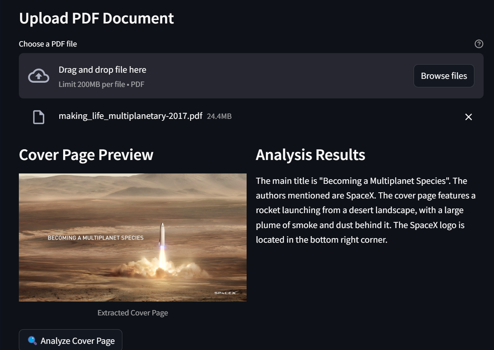

# 📄 PDFanalyzer with MoondreamAPI

> An intelligent PDF cover page analyzer powered by MoondreamAPI and Streamlit



## 🌟 Features

- 📊 Extract cover pages from PDF documents
- 🔍 Detailed visual analysis of cover pages
- 🤖 AI-powered content recognition
- 💫 Real-time processing and results
- 🎨 Clean and intuitive user interface
- 🧪 Comprehensive unit testing

## 🚀 Getting Started

1. Clone the repository
2. Install dependencies:
```bash
pip install -r requirements.txt
```
3. Get your Moondream API key
4. Run the application:
```bash
streamlit run app.py
```

## 🛠️ Technologies Used

- Streamlit - Web application framework
- MoondreamAPI - AI-powered image analysis
- PyMuPDF - PDF processing
- Pillow - Image handling

## 📁 Project Structure

```
├── .streamlit/          # Streamlit configuration files
├── images/              # Application screenshots and assets
├── prompts/            # AI analysis prompt templates
├── responses/          # JSON files storing analysis results
├── unit_tests/         # Unit tests and test results
│   ├── test_utils.py   # Test cases for utility functions
│   ├── run_tests.py    # Test runner with JSON reporting
│   └── test_results.json # Detailed test execution results
├── utils.py            # Utility functions and helpers
└── app.py             # Main application file
```

## 🔑 Configuration

1. Enter your Moondream API key in the application
2. Start analyzing PDF cover pages
3. Customize the analysis prompt in `prompts/prompt.md`

## 🧪 Testing

Run the unit tests:
```bash
python unit_tests/run_tests.py
```

Test results will be saved in `unit_tests/test_results.json` with detailed execution information.

## 📝 Contributing

Feel free to contribute to this project! Open an issue or submit a pull request.

ToDo's:

- Improving prompts to get even more detailed descriptions on PDFs
- Getting a smooth an smooth way solution to analyze the whole content of the PDF while not spending to many api calls, e.g: analyzing the context of the whole book without making 300 pages/ api calls, and spending less calls.

## 👨‍💻 Author

Created with ❤️ by [Eduardo Jose Barrios Garcia](https://edujbarrios.com) ([@edujbarrios](https://github.com/edujbarrios))

## 📜 License

This project is licensed under the MIT License - see the LICENSE file for details.
